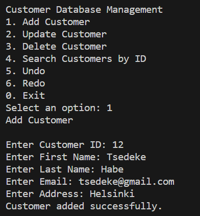
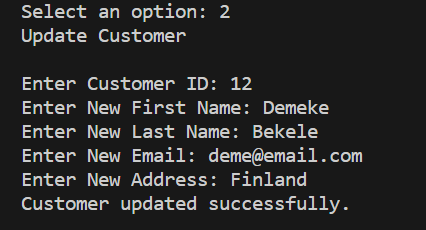
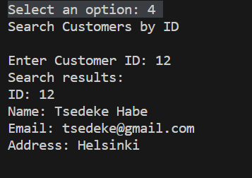
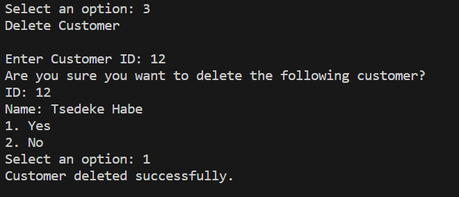

# Customer Database Management

This is a console application that allows you to manage a customer database. It provides functionality to add, update, delete, and search customers by their ID. The customer information is stored in a file called customers.csv, and any modifications to the database are recorded in this file.
## Features
1. Add Customer: You can add a new customer to the database by providing their ID, first name, last name, email, and address. The email must be unique in the database.

2. Update Customer: You can update the information of an existing customer by specifying their ID. You can modify their first name, last name, email, and address.

3. Delete Customer: You can delete a customer from the database by entering their ID. The deleted customer is stored in a separate list in case you want to undo the deletion later.

4. Search Customers by ID: You can search for customers by their ID. The application will display all the customers with matching IDs.

5. Undo: The application supports an undo feature that allows you to revert the last action performed. For example, if you added a customer, you can undo the addition to revert back to the previous state.

6. Redo: If you have undone an action, you can redo it using the redo feature. This allows you to restore the state of the database before the undo.
## How to Use
1. Clone or download the project files.

2. Build the project using a C# compiler or an integrated development environment (IDE) such as Visual Studio.

3. Run the compiled executable file to start the application.

4. The application will display a menu with different options for managing the customer database.

5. Select an option by entering the corresponding number and press Enter.

6. Follow the prompts and provide the required information to perform the selected operation.

7. The application will provide feedback on the success or failure of the operation.

8. To exit the application, select the "0. Exit" option from the menu.

## Undo and Redo Functionality
The undo and redo functionality allows you to revert or restore changes made to the customer database. Here's how it works:

* Undo: When you perform an action such as adding, updating, or deleting a customer, an undo action is automatically recorded. You can undo the last action by selecting the "5. Undo" option from the menu. The last action will be reversed, and the customer database will be restored to the previous state. You can continue to undo multiple actions in sequence.

* Redo: If you have undone an action and want to redo it, you can select the "6. Redo" option from the menu. The last undone action will be re-executed, restoring the customer database to the state after the undo. You can also redo multiple actions in sequence.

* Limitations: The undo and redo functionality only works within the current session of the application. Once you exit the application, the undo and redo stacks will be reset, and you won't be able to undo or redo previous actions. Additionally, the undo and redo functionality only applies to the most recent action performed. If you perform a new action after undoing, the redo stack will be cleared, and you won't be able to redo the previously undone actions.
The project consists of several files that implement different parts of the application:
## About the Files
* CustomerDatabase.cs: This file contains the CustomerDatabase class, which manages the customer database. It includes methods for adding, updating, deleting, and searching customers. It also implements the undo and redo functionality.

* FileHelper.cs: This file contains the FileHelper.cs class, which provides helper methods for reading and writing data to a CSV file.
* Program.cs: This file contains the entry point of the application. It is responsible for running the main loop and interacting with the user through the console.

* customers.csv: This file is the database file where customer information is stored. It is a comma-separated values (CSV) file format, with each line representing a customer record.
## Data Structure
The Customer class represents a customer and has the following properties:

* Id (string): The unique identifier of the customer.
* FirstName (string): The first name of the customer.
* LastName (string): The last name of the customer.
* Email (string): The email address of the customer.
* Address (string): The address of the customer.

The CustomerDatabase class manages the customer database and provides methods to interact with it. It uses a list of Customer objects to store the customer records in memory.

.cs class, which provides helper methods for reading and writing data to a CSV file.

Program.cs: This file contains the entry point of the application. It is responsible for running the main loop and interacting with the user through the console.

customers.csv: This file is the database file where customer information is stored. It is a comma-separated values (CSV) file format, with each line representing a customer record.

Data Structure
The Customer class represents a customer and has the following properties:

Id (string): The unique identifier of the customer.
FirstName (string): The first name of the customer.
LastName (string): The last name of the customer.
Email (string): The email address of the customer.
Address (string): The address of the customer.
The CustomerDatabase class manages the customer database and provides methods to interact with it. It uses a list of Customer objects to store the customer records in memory.

## CSV File Format
The customer data is stored in a CSV file named customers.csv. Each line in the file represents a customer record and follows the format:

        Id,FirstName,LastName,Email,Address

For example, a customer record might look like:

        1,John,Doe,johndoe@example.com,123 Main St

The FileHelper class provides helper methods to read customer records from the CSV file and write customer records to the CSV file.

## Error Handling
The application includes error handling to deal with various scenarios, such as invalid user input, duplicate emails, or file read/write errors. Error messages are displayed to the user when an error occurs, providing information about the issue encountered.

## Assumptions and Limitations
The application assumes that the user will enter valid inputs following the specified formats. It does not perform extensive input validation and relies on the user to provide correct data.

The application is designed as a console application and does not have a graphical user interface (GUI).

The undo and redo functionality is limited to the current session of the application and does not persist between sessions.
## Sample output

## Summary
This console application provides customer database management functionality, allowing you to add, update, delete, and search customers by their ID. It supports undo and redo actions, allowing you to revert or restore changes made to the database. The customer data is stored in a CSV file, and error handling is implemented to handle potential issues.